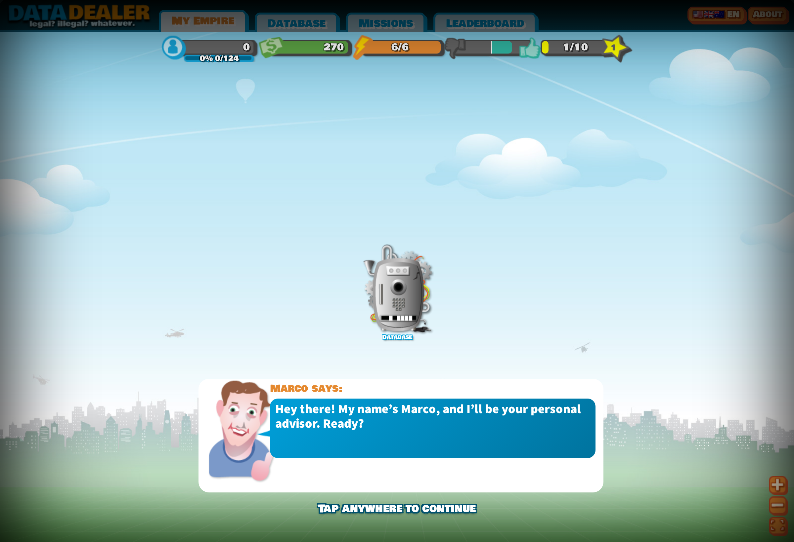
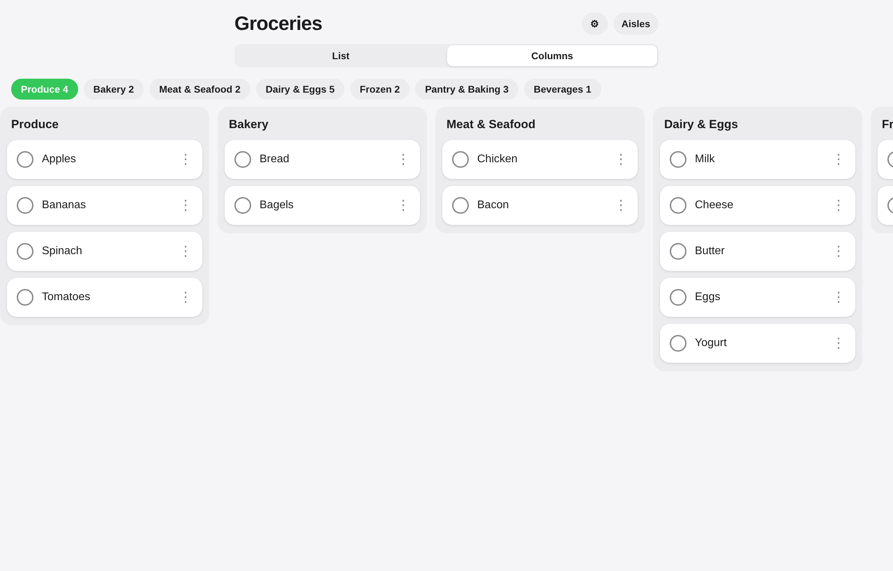
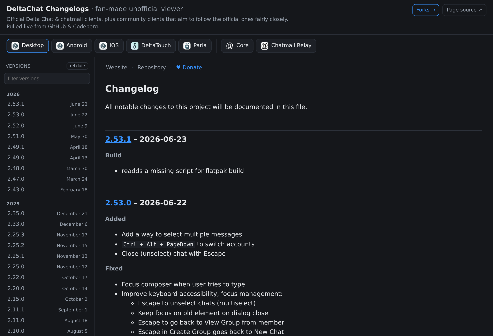

<h1 align="center">🧪 experintellia</h1>

  <b>An experimentation account — building things <i>with</i> AI to see how far AI-assisted development actually goes.</b>

  Every project here started as a question: <i>How far does agentic coding go?</i> 
  The repos below are the answers so far — mostly <a href="https://webxdc.org">webxdc</a> apps that run offline inside chats.

---

## 🔀 Ports

Reviving existing apps as standalone, serverless webxdc apps.

<table>
<tr>
<td width="90"></td>
<td>
<b><a href="https://github.com/experintellia/data_dealer">Data Dealer</a></b> 
The satirical privacy game <i>Data Dealer</i> — you run a shady data-broker empire and learn, first-hand, how personal data gets harvested, traded, and abused. The original relied on a game server that's since been abandoned, so it's no longer playable; this port revives it as a fully standalone webxdc app — no server needed, playable again offline. 
webxdc · TypeScript · Vite
</td>
</tr>
</table>

  

## 📦 New webxdc apps

Built from scratch — collaborative mini-apps you send into a chat, where the whole group edits together, offline-first.

<table>
<tr>
<td width="90"></td>
<td>
<b><a href="https://github.com/experintellia/md-docs">MD-Docs</a></b> 
A collaborative, Obsidian-style markdown editor — a single <code>.xdc</code> you drop into a group where everyone edits the same document live. 
webxdc · CodeMirror 6 · Yjs · TypeScript
</td>
</tr>
</table>

  

<table>
<tr>
<td width="90"></td>
<td>
<b><a href="https://github.com/experintellia/ordered-shopping-list">Grocery Board</a></b> 
A collaborative shopping list that auto-sorts items into store-aisle sections — view as a <b>List</b> or swipeable <b>Columns</b>. Inspired by Apple Reminders. 
webxdc · TypeScript
</td>
</tr>
</table>

  

## 🧰 Other projects

<table>
<tr>
<td width="90" align="center">📜</td>
<td>
<b><a href="https://github.com/experintellia/deltachat-changelogs">DeltaChat Changelogs</a></b> 
A fan-made changelog viewer for the DeltaChat ecosystem — pulls changelogs live from GitHub &amp; Codeberg, with per-client tabs, search, and scroll-spy TOC. 
static site · vanilla JS
</td>
</tr>
<tr>
<td width="90" align="center">🧬</td>
<td>
<b><a href="https://github.com/experintellia/slothfulchat-web">slothfulchat-web</a></b> 
A feasibility prototype running a full Delta Chat client <b>standalone in the browser</b> — the chatmail core compiled to WebAssembly, driving the Delta Chat Desktop frontend as a PWA (over a local TCP proxy). Experimental, AI-coded patch stack. 
Rust → WASM · PWA · TypeScript
</td>
</tr>
</table>

  

---

  Everything here is AI-built experimentation — a running log of what's possible when building with LLM-Coding agents. 🤖

